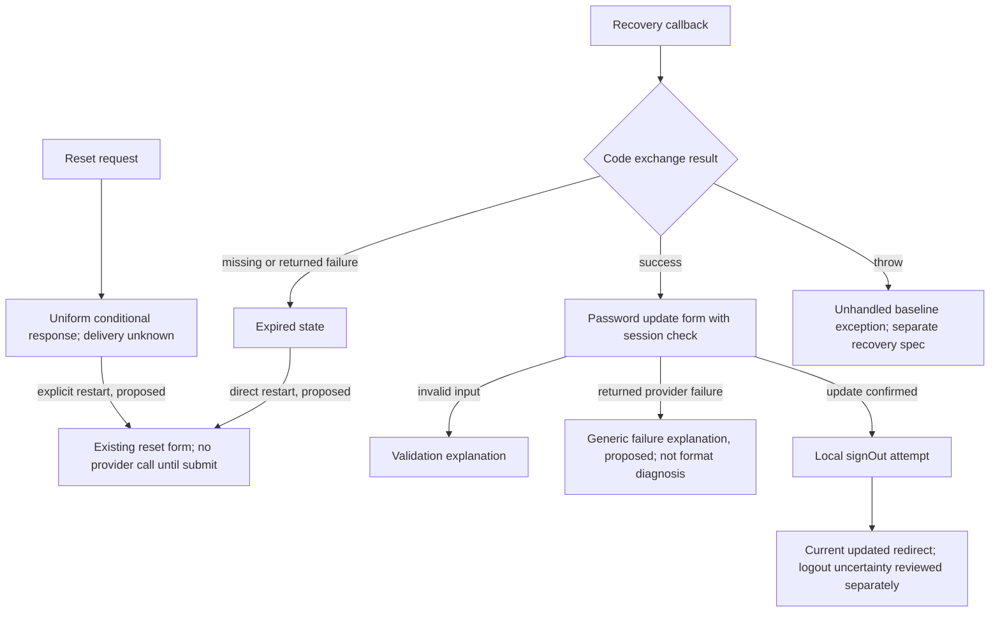

# R2-AUTH-CORE — reviewed source contract and recovery slice

Status: **Proposed**. Source snapshot `b180a4e1a9c8f2f142bd5ae9f1e142daffd06e9f`; application source unchanged. This record governs interpretation of [Claude's contribution](claude-auth-core-contribution.md), not provider/session policy changes. [Mandatory journey improvement](journey-improvement-contract.md) applies.

## Coverage and evidence

Scope: four actions in `src/app/auth/actions.ts`; `safe-next.ts`; login, forgot-password and password/update pages; recovery callback endpoint; shared SubmitButton. Boundaries: Supabase server/proxy helpers, root proxy and next.config. Configuration names only: NEXT_PUBLIC_SUPABASE_URL, NEXT_PUBLIC_SUPABASE_PUBLISHABLE_KEY, NEXT_PUBLIC_APP_URL. One core RPC: current_tenant_spaces. Invitations/activation, tenant admin and downstream workspace authorities remain outside this slice.

The contribution contains **41** journey rows (LI17 + SO2 + FP6 + CB8 + UP8), plus **12** safe-next equivalence classes, not its reported44. [Canonical scenario register](auth-core-scenarios.json) retains these IDs and adds explicit thrown-failure cases. Each source row is reviewed against code; live outcomes, responsive metrics and improvement acceptance are not-run.

The source inventory finds 9 direct form/input slots in the three pages (3 forms + 6 inputs, including hidden next), plus one shared button definition reused three times. Runtime composition therefore includes 3 submit instances. Avoid conflating AST definitions, rendered instances and editable fields.

`node scripts/check-ux-auth-core.cjs <repo-root> <existing-artifact-directory>` executes actual action/allowlist/server-helper/callback source, using installed TypeScript and real NextRequest/NextResponse, with stubbed Auth/RPC SDK and request cookie context. It does not read project environment files, contact providers or start the app. **60/60 characterization checks passed**. Tests intentionally reproduce current defects: ignored logout errors, absent route-local failure cache headers, discarded failure cookies and unhandled exceptions. Passing those tests is not passing desired UX/security acceptance. Artifacts are written outside the repository. Provider/HTTP/browser end-to-end behavior remains unverified.

## Reviewed corrections and boundaries

1. Expired reset has no direct request-new-link action, but a longer login→forgot route exists. Describe a missing direct recovery path rather than claiming no possible route. The proposed restart uses the existing `/auth/forgot-password` route, with explicit user action and unchanged provider call/anti-enumeration behavior.
2. `state=sent` is a uniform response regardless of delivery outcome. It must never be phrased as confirmed mail delivery. Any resend remains an explicit user choice, with provider rate controls unchanged.
3. Returned signIn errors redirect to invalid; **thrown** client/auth/RPC failures are unhandled locally. Reset catches URL/provider throws inside its try, but client construction occurs outside it. Update/page/callback/logout have separate thrown-failure paths. Do not conflate all network failures with returned errors.
4. Update returned provider failure uses state=failed, but the page currently renders validation text for any truthy state. Generic service failure text must not diagnose password format or invite automatic resubmission of an uncertain operation. Unknown state should not imply a validated error.
5. Missing client does not prove no session cookies exist. SO-02 currently redirects signed-out without a confirmed provider signOut; its safety is an open session review. Password update success and local signOut success are distinct outcomes; returned signOut error is ignored by current code.
6. Client login minLength8 differs from action's nonempty check. Existing accounts with shorter passwords are a hypothesis, not an observed fact. Changing policy is deferred outside presentation work.
7. Callback consumes any exchangeable code and directs to password/update; an authenticated ordinary session can also visit the update page. These are current behaviors, not a finding that a exploit exists. Recovery intent, assurance/current-password policy and cross-browser PKCE need security/provider qualification.
8. Callback missing-code/exchange-error branches return fresh redirects without route-local no-store/cookie copies. The no-store proxy dependency is explicit; integration tests must verify effective headers/cookies for every branch. Success-path evidence cannot qualify failure branches. Cross-host and uppercase destinations are hypotheses pending rendered/deployment tests.
9. safeAuthNext remains exact allowlist; destination access checks remain authoritative. Membership missing/error/malformed/empty fallback to operator grants no role. D8/D13 remain outside the presentation slice.
10. The draft AM-A1…A11 change-class labels are **proposals**, not approved classifications. `docs/06-governance/change-control.md` governs: signature/state changes, resend frequency, session recovery or new boundaries need scoped review. Copy and an explicit link to an existing route can be normal Class C when preserving accepted behavior. Every material change retains its amendment history.

## Bounded first recovery improvement

Candidate R2-AUTH-UI-01: add a direct restart link in expired/sent states, separate invalid versus generic failed update wording, make setup wording user-facing, and preserve known-state/unknown-state handling. No action signatures, provider calls, cookies, authorization, password policy, redirects/allowlist or dependencies change. New error boundaries, callback response changes, email-state retention and shared signOut changes are excluded pending their own reviewed specs.

Acceptance: (a) expired has a keyboard/touch-accessible restart without URL editing; (b) sent stays conditional and an explicit restart issues no request until submit; (c) invalid describes local validation, failed states service uncertainty honestly, unknown state invents no error; (d) setup names the user's next action without exposing configuration; (e) source action/helper/callback/allowlist fingerprints unchanged; (f) normal form labels, autocomplete, minLength, hidden next, pending state and authorized redirects preserved; (g) before/after phone/tablet/desktop evidence for changed visible states and no overflow; (h) no claim of authenticated/provider UAT from mock checks.

Measurement start/goal: expired callback landing → visible reset form; sent confirmation → explicit new reset form; invalid login → ready to retry with required credentials; failed password update → correct explanation and useful next action; setup → responsible support path. Record N/C/P/I/B and completion/backtracking for the same state/device, classify source-derived predictions separately. Target for expired: zero manual query editing and one direct restart; target for failure copy: no false format diagnosis. No invented before numbers.

## Recovery map

## Remaining acceptance gates

Stage R2 is not complete. Provider error taxonomy, session/logout assurance, effective callback/cache headers, PKCE/browser/host behavior, scoped amendments, live synthetic-account journeys and measured before/after evidence remain open. Broad Today/inbox/People/Attendance/Payroll redesigns continue under their own stages; this slice cannot certify them.
