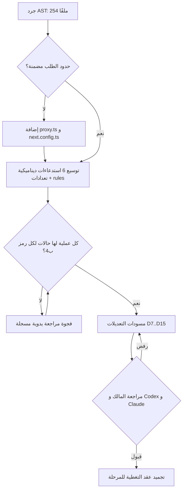
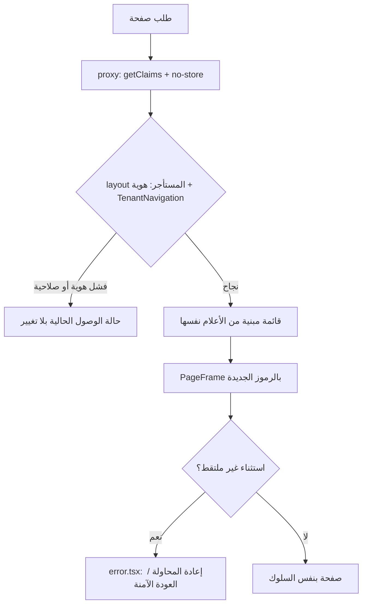
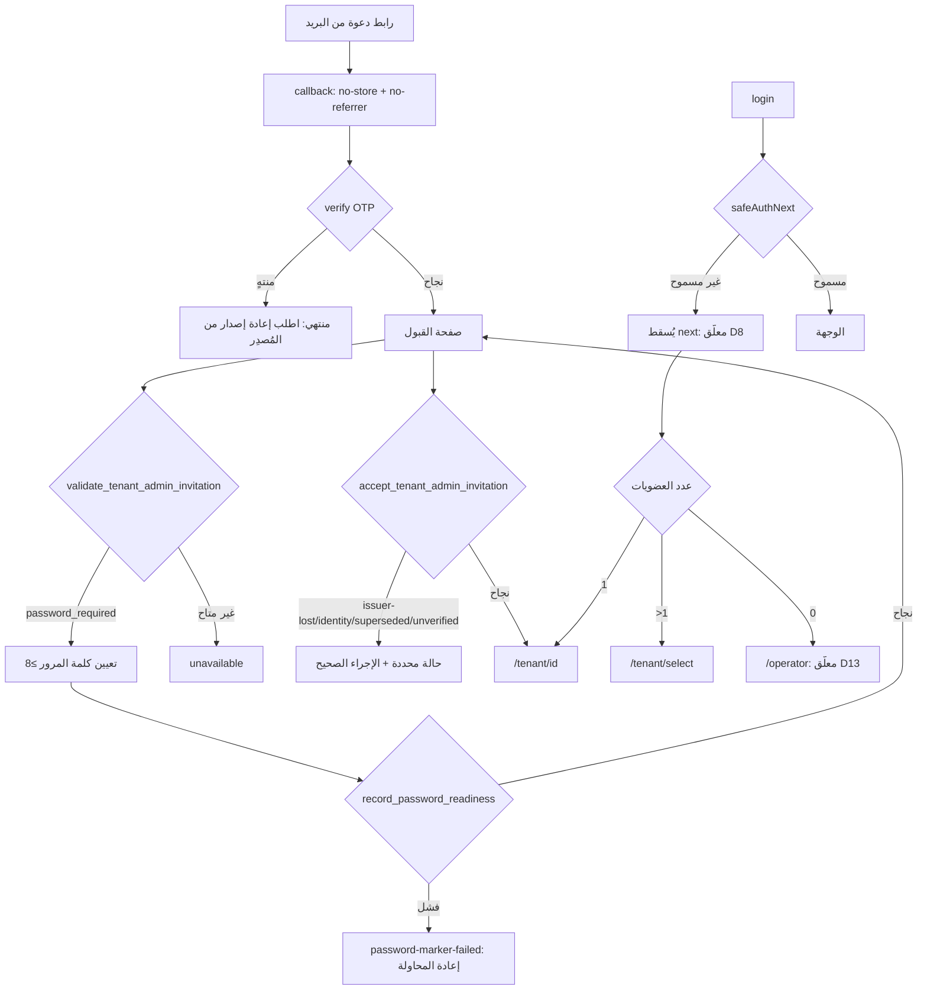
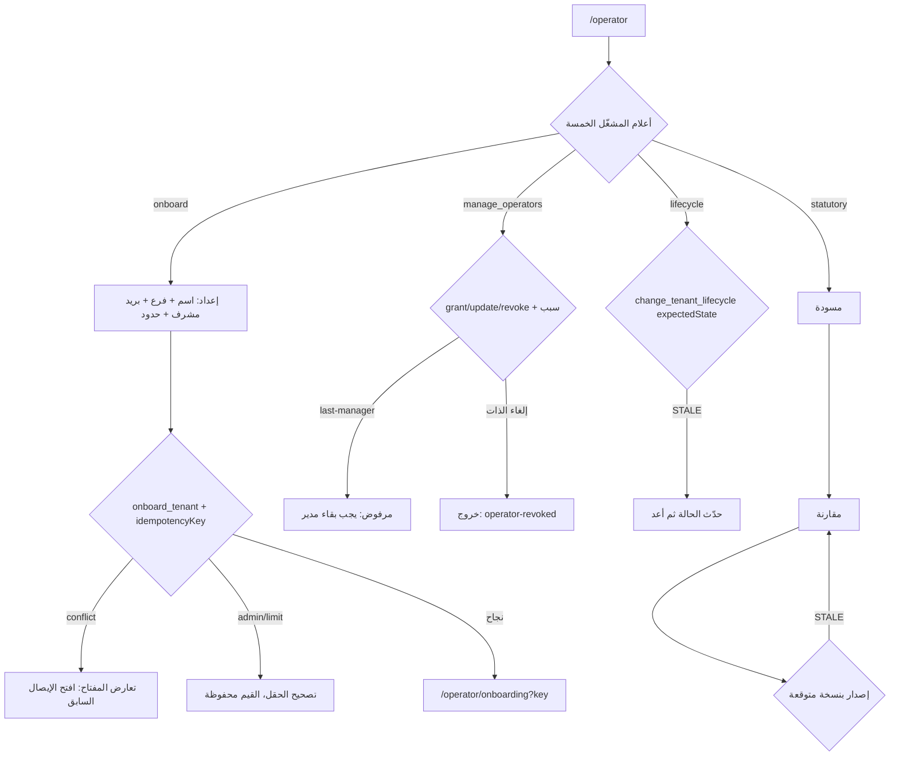
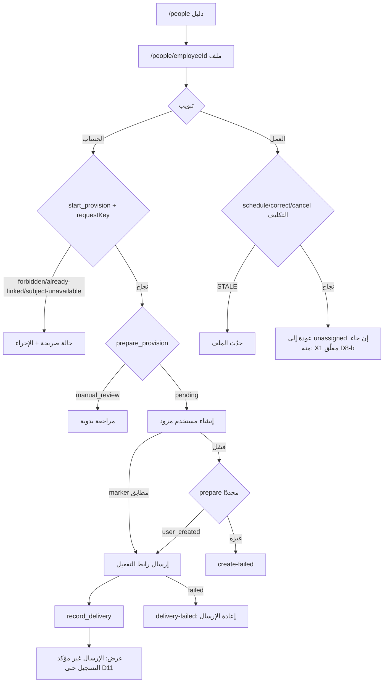
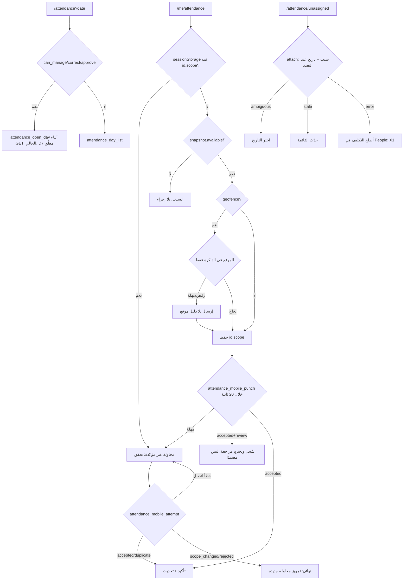
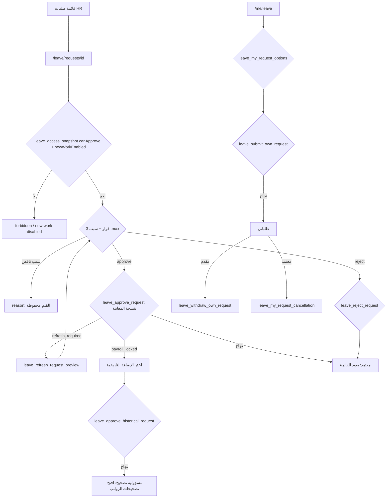
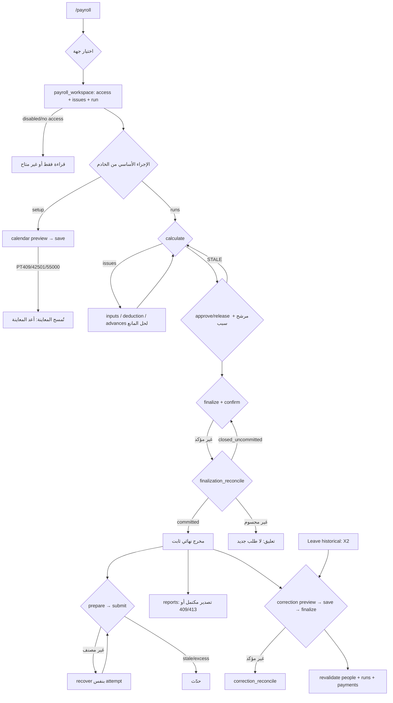
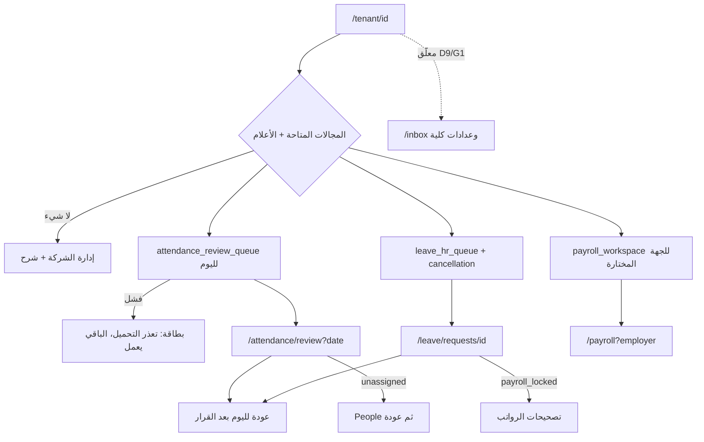

# مساهمة مقترحة في مواصفات إعادة تصميم UX: المراحل R0 إلى R8، عقد التغطية، وخرائط الرحلات

| البند | القيمة |
|---|---|
| الحالة | **مقترحة (Proposed)**. ليست أساسًا للتنفيذ ولم تُجمَّد بعد. |
| الأساس | HEAD `6bfd604`، ويتضمن شجرة Cube5 `1c06640` عبر `afdc9a2` |
| المراجع المقروءة | `AGENTS.md` و`ux-redesign-reference.md` والخطة الأصلية كاملة مع الملحق أ، وتقرير التوافق، و`change-control.md` و`spec-lifecycle.md` و`quality-gates.md`، وأجزاء من `frontend-ux-baseline.md` و`platform-experience-architecture.md`، و`inventory.json` (الملخص والمسارات وأسطر الأفعال والاستدعاءات الديناميكية) |
| المصدر المقروء مباشرة | حوالي 30 ملفًا في auth وoperator وattendance وleave وpayroll وpeople، إضافة إلى `proxy.ts` و`next.config.ts` |
| ما لم يُراجع دلاليًا | كل حقل من 985 حقل نموذج. كل صفحة من صفحات people/leave settings/entities سطرًا بسطر. تخزين journal السلف. المحتوى التفصيلي لعروض الديمو. |

---

## أ. الحكم والتصحيحات المستندة إلى المصدر

**الحكم:** تقسيم R0 إلى R8 مقبول كإعادة تجزئة للموجات W0 إلى W7، بأربعة شروط:

1. يصبح R0 عقد تغطية وتعديلات (amendments) وليس مجرد حوكمة.
2. يُفصل PWA والفجوات G1 إلى G9 في مسارات مستقلة محروسة.
3. تُقسم R5 وR6 داخليًا إلى جزء خدمة ذاتية وجزء HR، لأن الموظف أكثر المستخدمين تكرارًا.
4. يُفصل في R8 بين «اليوم/القرارات» المشروطة بتعديل وبين الإحكام (closure).

أرقام الجرد صحيحة هيكليًا: `sourceAssignmentComplete:true`. لكنه يعلن صراحةً `semanticScenarioReviewComplete:false` و`executionCoverageComplete:false`. لذلك لا يجوز ادعاء تغطية 100%.

### نتائج تصحيحية (كل منها موثق بسطر مصدر)

| # | النتيجة | الدليل | الأثر على المواصفة |
|---|---|---|---|
| F1 | فتح يوم الحضور **يحدث أثناء عرض GET** لمن يملك manage أو correct أو approve. ادعاء الخطة (§2.4، §7.1، §15.2) بأنه «إجراء صريح» خاطئ. | `attendance/page.tsx:25-28` | السلوك الحالي يُحفظ في R5. جعله «زرًا صريحًا فقط» = **تعديل معلّق D7** وليس إعادة تلبيس. G8 (الجدولة) مسار Class A مستقل. |
| F2 | **اعتماد الإجازة يتطلب سببًا** بنفس حدي الطول، والخطة قالت «الاعتماد لا يتطلبه». | `leave/actions.ts:107-110` | لا يُحذف حقل السبب من لوحة الاعتماد. |
| F3 | الاعتماد التاريخي `leave_approve_historical_request`. والخطأ `payroll_locked_leave_addition_requires_correction` يوجّه إلى تصحيحات الرواتب. | `leave/actions.ts:116-127` | رحلة عابرة للمجالات Leave→Payroll (X2). |
| F4 | طلب الموظف إلغاء إجازته يستدعي `leave_my_request_cancellation`، لا `leave_request_cancellation` كما في الخطة §7.7. الثانية مسار HR. | `me/leave/[requestId]/cancellation-actions.ts:28`، `leave/actions.ts:210` | تصحيح جدول المصادر. |
| F5 | قائمة `safeAuthNext` المسموحة لا تشمل attendance وleave وpeople وme وstatutory و`/tenant/select`. لذلك يضيع الرابط العميق بعد الدخول رغم أن الصفحات ترسل `next=`. | `safe-next.ts:2-11`، `attendance/page.tsx:19`، `unassigned/page.tsx:15` | يخالف `platform-experience-architecture.md:118`. التوسيع تغيير أمني (**D8**) يحتاج مراجعة، ولا يتم أثناء إعادة التلبيس. |
| F6 | الدخول بلا عضويات يحوّل إلى `/operator`. | `auth/actions.ts:18-24` | يُوثق مسار «لا عضوية» في R2 (**D13**). |
| F7 | `proxy.ts` (no-store لكل استجابة) و`next.config.ts` (no-store وno-referrer لثلاث صفحات callback) **خارج** نطاق الجرد `src/**`. | `proxy.ts:4-9`، `src/lib/supabase/proxy.ts:4-16`، `next.config.ts:12-31` | يُضاف قاسم «حدود الطلب» من ملفين إلى R0 وR1 وR2. |
| F8 | تسليم تفعيل حساب الموظف لا يتحقق من خطأ `record_people_employee_account_delivery` قبل إعلان `delivery-sent`، بخلاف مسار readiness الذي يتحقق. | `people/employee-account-actions.ts:115-119` مقابل `:54-58` | لا تعرض الواجهة «سُلِّم» كحقيقة مؤكدة. سلوك يحتاج قرارًا (**D11**)، ولا يُعدّل في R4 البصري. |
| F9 | التصدير `output/export` يجلب صفحة واحدة (`p_limit:30`) باسم `payroll-page.csv`. أما `reports/export` فيثبت الاكتمال ولا يصدر ملفًا جزئيًا (409/413). | `output/export/route.ts:10,15`، `reports/export/route.ts:18-37` | يجب أن توضح الواجهة أن الأول «تصدير هذه الصفحة» (**D12**). |
| F10 | عقد التحكم الحالي: 44px **حتى عرض 900px**. والخطة تقترح نقطة تحول عند 860. | `frontend-ux-baseline.md:65`، الخطة §5.3 | تبقى 900 مجمدة حتى تعديل (**D10**). |
| F11 | المعمارية تقول «Avoid a speculative universal inbox». | `platform-experience-architecture.md:88` | `/inbox` الجديد تغيير Class B يحتاج تعديلًا (**D9**)، وR8 محروس به. |
| F12 | مراحل الرواتب الفعلية: `calculate/cancel/finalize`، ثم اعتماد المرشح `approve/release` بسبب 3-500، ثم finalize بمرشح وتأكيد. اشتقاق الخطة من `run.status` وحده مبسّط أكثر من اللازم. | `runs/actions.ts:9-16`، `runs/approval-actions.ts:10`، `runs/page.tsx:40-51` | أي شريط مراحل يُشتق من حقول الخادم، مع حالة «غير معروف»، وبمراجعة مسؤول الرواتب. |
| F13 | فعل الربط `attach` المضمّن في الصفحة (inline) يحمل أربع نتائج: `attached/ambiguous/stale/error`. | `unassigned/page.tsx:20,26-29` | فعل مستقل في عقد التغطية. |
| F14 | 107 «دوال خادم» ليست 107 عمليات. انظر توسيع العمليات في (ب2). | — | عدّ العمليات وليس الملفات. |

---

## ب. عقد التغطية

### ب1. القواسم

| القاسم | العدد | المصدر | حالة الربط بالمواصفة |
|---|---|---|---|
| صفحات `page.tsx` | 75 | `inventory.routes` | مربوطة بالمراحل (ج) |
| نقاط نهاية `route.ts` | **3**: `/auth/callback` و`payroll/output/export` و`payroll/reports/export` | `inventory.routes` | R2 وR7 |
| حدود (boundaries) | 8: ثلاث تخطيطات وخمسة loading. **صفر** error/not-found | `inventory.boundaries` | R1 |
| ملفات حدود الطلب خارج الجرد | 2: `proxy.ts` و`next.config.ts` | F7 | R0 يضيفها |
| دوال خادم | 107، منها واحدة مضمّنة | `inventory.serverActions` | موزعة: auth 13، operator 11، tenant admin 15، people 21، attendance 12، self 6، leave HR 17، payroll 12 |
| مواقع استدعاء RPC | 341، منها 215 اسمًا حرفيًا و6 ديناميكية | summary | توسيع الديناميكية في ب2 |
| حقول النماذج | 985 | `formControls` | **لم تُراجع دلاليًا**. التزام مراجعة لكل مرحلة |
| أدوار وأعلام صلاحية | ب3 | snapshots | لكل مرحلة |
| مكونات مشتركة | 4 ملفات `src/components` + `PageFrame` + CSS مشترك | الخطة §2.1 | R1 |
| خطوات الخدمة | تدفقات من مرحلتين (intent→provider→record، prepare→submit، preview→save، command→reconcile) | ب2 | كل مرحلة |
| رحلات عابرة للمجالات | X1 إلى X7 (ب5) | المصدر | R8 يغلقها، ومالكوها في مراحلهم |

### ب2. توسيع العمليات (تحقق يدوي)

| الدالة | العمليات أو الفروع المتحقق منها | الدليل |
|---|---|---|
| `runAction` | `calculate`، `cancel` (سبب 3-500)، `finalize` (مرشح + `confirm=on`). RPC من أربعة: `payroll_run_command` و`payroll_run_reconcile` و`payroll_run_finalize` و`payroll_run_finalization_reconcile`. النتائج `committed` و`closed_uncommitted` | `runs/actions.ts:9-22` |
| `approvalAction` | `approve` و`release` (سبب 3-500) → `payroll_candidate_approval` | `approval-actions.ts:10-15` |
| `deductionDispositionAction` | `carry` و`external_settlement` (تأكيد `yes`)، `retract`، `recover` → `payroll_deduction_reconcile`. الحالات idle/committed/not_committed/unresolved | `deduction-disposition-actions.ts:6-30` |
| `advanceAction` | عشر عمليات: save/approve/activate/cancel/settle/compensate/termination/defer/correct_deduction/correct_disbursement. كل منها بوضعين: `payroll_advance_command` أو `payroll_resolve_advance_attempt` | `advances/rules.ts:5`، `actions.ts:11` |
| `correctionAction` | preview/save → `payroll_correction_proposal` (للـsave يلزم previewHash). finalize (تأكيد) → `payroll_correction_finalize`. settlement. `approve_candidate` و`release_candidate` → `payroll_candidate_approval`. وفرع عام → `payroll_correction_command` بقيم الصفحة approve/calculate/route_paid/release/cancel. الاسترداد عبر `payroll_correction_reconcile` و`payroll_correction_finalization_reconcile`. قفل التوقيع: لا تغيير للقيم قبل حسم النتيجة المعلقة | `corrections/actions.ts:14-68`، `corrections/page.tsx:77-87` |
| `correctionChoices` | `payroll_correction_choices` (بحث مع ترقيم) | `:71-75` |
| `inputAction` | خمسة أنواع (manual_units وrecurring وadjustment وopening_ytd وstatutory_context) × ثلاث عمليات (save/approve/cancel) → `payroll_save_input`. التركيبات الصالحة لكل نوع **تحتاج تحقق** | `inputs/actions.ts:12-26` |
| `inputs/correctionAction` | `payroll_request_correction` (سبب) | `:31-40` |
| `paymentAction` | allocations/remaining/compensate → prepare ثم submit. والاسترداد `__recover` وإلغاء الطلب `__cancel`. والأخطاء المصنفة غير معلقة `22023/42501/23514/PT409/55P03/40P01/55000` | `payments/actions.ts:9-44` |
| `calendarAction` | preview، save (مع attemptKey)، cancel محلي بلا RPC | `payroll/actions.ts:10-28` |
| `generateAction` | `payroll_generate_next_period` | `:31-42` |
| `authorizePayslipPrint` | يتحقق من revision وissues=0 وصف واحد | `print-actions.ts:5-13` |
| `mutateChannel` | save (mobile/geofence)، map (فترة سريان بتوقيت صريح)، review (يتطلب `can_review`)، reprocess | `sources/actions.ts:6-34` |
| `attach` (مضمّن) | `attach_unassigned_attendance_evidence_for_date` بسبب 3-500 وتاريخ عند تعدد المرشحين | `unassigned/page.tsx:20,32` |
| `decideRequestAction` | approve يمر إلى approve أو historical، وreject. replace → `leave_correct_approved_request`. والحالة `refresh_required` | `leave/actions.ts:21-130` |
| `annualAction` | policy وpreview وpost (`reviewHash` + `operationKey`). النتيجتان posted وup_to_date | `annual/actions.ts:13-31` |
| `saveWorkPolicyAction` | fixed/flexible؛ RPC `save_time_work_policy` أو `..._with_leave_mapping` | inventory:6344 |
| `saveOrgCatalogAction` | departments/jobs × create/update/disable/reactivate. النتائج created/updated/deactivated/reactivated/unchanged | `organization/actions.ts:20-56` |
| `changeOperatorGrantAction` | grant/update/revoke. حالات: إلغاء صلاحية الذات (خروج)، و`last-manager`، وalready-*/unchanged | `operators/actions.ts:16-65` |
| `onboardTenantAction` | limited/unlimited للمقاعد والفروع. الحالات forbidden/admin/limit/conflict/failed/setup | `operator/actions.ts:8-46` |

**ما بقي للتوسيع اليدوي:** التركيبات الصالحة في inputs، وفروع الصفحات العشرين للعمليات العامة في corrections، وتعدادات `rules.ts` المستوردة لكل مجال (رموز الأخطاء والحالات)، وفروع entities-sites وusers وstatutory.

### ب3. الأدوار وأعلام الصلاحية (لا يُشتق دور من الاسم)

| المجال | الأعلام الفعلية |
|---|---|
| الحضور | `time_attendance_access_snapshot`: can_view وcan_manage وcan_correct وcan_approve وentitlement_enabled. و`attendance_channel_access`: can_view وcan_manage وcan_review |
| الإجازات | `leave_access_snapshot`: canApprove وcanManage وnewWorkEnabled والوصول الذاتي |
| الرواتب | `access` في workspace: enabled وcan_prepare وcan_payment_record وcan_view_final. والتنقل: can_view_advances وcan_view_reports |
| المشغّل | خمسة: manage_operators وonboard وlifecycle وcommercial وstatutory |
| الشركة | tenant admin مع protected admin وbundles الأفراد وself-access للإجازات |

### ب4. تصنيف النتائج (إلزامي لكل عملية)

| الرمز | المعنى |
|---|---|
| OK | نجاح |
| DUP | idempotent، أو unchanged، أو up_to_date، أو duplicate |
| VAL | تحقق محلي أو خطأ 22023 |
| AUTH | لا جلسة، أو 42501، أو تغير الفاعل |
| ENT | الوحدة غير مفعّلة، أو new-work-disabled |
| STALE | PT409، أو version، أو refresh_required، أو preview قديم |
| LOCK | 55P03 أو 40P01 |
| UNK | نتيجة غير مؤكدة تحتاج reconcile |
| CLOSED | closed_uncommitted |
| EXT | فشل مزود خارجي: بريد أو موقع |
| SETUP | لا عميل أو إعداد ناقص |

### ب5. الرحلات العابرة للمجالات

| الرمز | الرحلة |
|---|---|
| X1 | دليل بلا تكليف → تكليف الموظف (People) → عودة للربط |
| X2 | اعتماد إجازة تاريخية → مسؤولية تصحيح في الرواتب |
| X3 | تصحيح الرواتب → revalidate لصفحة people (`corrections/actions.ts:61`) |
| X4 | إضافي غير مصنف → مستبعد من مدخلات الرواتب، تنبيه وليس مانعًا |
| X5 | إنشاء موظف → حساب وتفعيل (Auth) → عضوية |
| X6 | سياسة الدوام وربط الإجازات → حضور وإجازة |
| X7 | قناة الموبايل → `/me/attendance` (revalidate) → مراجعة الموقع |

### ب6. شكل الحالة ومستويا التغطية

**حقول كل حالة:** `ID | المتطلبات | الفاعل والعلم | النطاق (tenant/employer/period/record) | الإجراء | النتيجة المتوقعة (مصدر الحقيقة) | الفشل (رمز ب4) | الاسترداد | الدليل (ملف:سطر + لقطة أو اختبار)`.

- **التغطية 100% على مستوى المواصفة:** كل عنصر في ب1 وب2 له حالة واحدة على الأقل لكل رمز ب4 ينطبق عليه، مع تعليل «لا ينطبق».
- **التغطية 100% على مستوى التنفيذ:** كل حالة نُفذت على المراجعة نفسها بدليل. **لم يتحقق أي منهما بعد.** والجرد الثابت لا يثبت «كل الاحتمالات الممكنة»، بل يحدد القاسم فقط.

**البوابات القائمة باقية كما هي:**

- Cairo 600 بحجم 14px، وradius 8، وارتفاع 40/44 حتى 900px.
- الأدوار والاستحقاقات والروابط وعقود RPC والقرارات المالية بلا تغيير.
- لا عرض لصافي الراتب قبل التأهيل المالي، ولا YTD مفترض.
- لا تخزين للإحداثيات خارج الذاكرة.
- حالة `review_required` ليست حضورًا معتمدًا.
- مسارات Cube4 وCube5 المفتوحة (القانوني، والأجهزة، والسعة، والتجربة الميدانية، والمورد، والخصوصية، والبصمة الحيوية) لا يغلقها الديمو.

---

## ج. مواصفات المراحل

### صيغة المقاييس

لكل رحلة تُقاس خمسة أمور:

| الرمز | المقياس |
|---|---|
| N | عدد التنقلات |
| C | عدد مرات إعادة اختيار السياق |
| P | عدد الأزرار الأساسية المتنافسة |
| I | عدد الحقول المطلوبة |
| B | خطوات حل المانع |

أرقام «قبل» مشتقة من قراءة الروابط في المصدر، ويثبتها R0 بجولة فعلية. **لا يجوز خفض I عن متطلبات الخادم.**

---

### R0: الحوكمة وعقد التغطية وجدول التعديلات

**المهمة والقيمة:** أساس تتبع قابل للتجميد، يمنع ظهور «تعديل صامت» في الكود.

**المصادر:**

- `inventory.json` و`scripts/build-ux-inventory.cjs` (غير متتبع).
- المسودات في `docs/04-product-specs/ux-redesign/`.
- الوثائق الحاكمة.

**التسلسل:**

1. إضافة ملفات حدود الطلب (F7).
2. توسيع العمليات الست الديناميكية وتعدادات `rules.ts`.
3. سجل حالات ب6 لكل مرحلة، كهيكل مع حالات ممثلة.
4. مسودات التعديلات D7 إلى D15.
5. مطابقة الديمو مع كل مرحلة، كمرجع بصري فقط.
6. خط أساس للمقاييس N وC وP وI وB.

**ممنوع في R0:** أي كود، أو أي تغيير في وثيقة مجمدة بلا تعديل.

**القبول:**

| المعرّف | الشرط |
|---|---|
| AC-R0-01 | القواسم مطابقة لملخص الجرد + 2 |
| AC-R0-02 | صفر عمليات ديناميكية بلا فروع |
| AC-R0-03 | كل تعديل مكتوب بصيغة `spec-lifecycle` |
| AC-R0-04 | بصمة HTML المرجعي مطابقة `AF2401…7508` |

---

### R1: نظام التصميم المشترك والإطار

**المهمة:** مظهر موحد دون تغيير السلوك. يقابل W1 دون PWA ودون تبديل الخط.

**المصادر:**

- `layout.tsx` وملفا CSS المشتركان.
- `context-navigation(.tsx|-client.tsx)`: `TenantNavigation` بـ19 موضع RPC في الملف و14 متوازية بحسب المراجعة.
- `submit-button` و`feedback-toast` و`tenant/[tenantId]/layout.tsx` (الهوية بأربعة مفاتيح).
- `supabase/{server,admin,proxy}.ts`.

**التسلسل:**

1. W1.a: الرموز الفاتحة وقد بدأت.
2. ربط الأصناف القديمة بالرموز.
3. المكونات الأساسية.
4. حدود error وnot-found بنص استرداد، **كإضافة بمواصفة**.
5. تجميع التنقل بـ`React.cache` دون G9.

**المقاييس:** P≤1 زر أساسي في رأس كل صفحة بعد R1 على العينة. عدد روابط التنقل الظاهرة دون تغيير الصلاحيات.

**ممنوع:** تغيير مقاس الخط أو الارتفاع أو الاستدارة، والوضع الداكن إن كسر التباين، وPWA، وترقية المجال (D2)، ونقطة 860 (D10).

**القبول:**

| المعرّف | الشرط |
|---|---|
| AC-R1-01 | بصمات منطق TS/TSX مطابقة للأساس |
| AC-R1-02 | تباين AA لكل زوج ألوان |
| AC-R1-03 | لقطات قبل/بعد لكل الصفحات الـ75 عند 390 و768 و1366 |
| AC-R1-04 | بقاء no-store في `proxy` و`callbacks` |
| AC-R1-05 | لا ظهور لرمز داخلي في error.tsx |

---

### R2: الدخول والحساب وحوكمة الشركة

**المهمة:** دخول واستعادة وقبول دعوات وإدارة مستخدمين وهيكل وهوية، بلا لبس في الحالة.

**المصادر:**

- 9 صفحات `/auth/**` و`/auth/callback/route.ts`، و`auth/actions.ts` (4 دوال).
- دوال الدعوات: `validate/accept_tenant_admin_invitation` و`record_tenant_admin_password_readiness`.
- دعوات الأعضاء (3 دوال).
- `tenant/select`.
- `users` (8 دوال): create/reissue/revoke للدعوة، و`set_tenant_member_access`، وbundles، و`set_tenant_member_leave_self_access`، و`change_tenant_admin_role`، و`record_tenant_member_invitation_delivery`.
- entities-sites: 4 صفحات و6 دوال.
- branding: صفحة واحدة ودالة واحدة.

**التسلسل المقترح للتبسيط الحقيقي:**

1. **بطاقة حالة واحدة لكل رابط دعوة:** تعرض رسالة واحدة بإجراء واحد لكل حالة بدل نص عام.
2. **إدارة المستخدمين:** القائمة ثم ورقة جانبية للعضو، تجمع الوصول وbundles والاستثناء الذاتي ونقل الإدارة في سياق واحد.
3. **الجهات والفروع:** نسخ وحالة في صفحة الكيان.

**تقسيم سيناريوهات الحساب (تفصيلي):**

| المعرّف | الحالة | الدليل |
|---|---|---|
| A-LOGIN | invalid / setup / نجاح مع next آمن / نجاح بعضوية واحدة → tenant / عضويات متعددة → select / بلا عضوية → /operator (F6) / next غير مسموح يُسقط (F5) | `auth/actions.ts:7-25` |
| A-RESET | يعرض «sent» دائمًا دون كشف وجود الحساب. callback: لا رمز → expired، فشل التبادل → expired، نجاح → update مع no-store | `actions.ts:27-42`، `callback/route.ts` |
| A-UPDATE | invalid (أقل من 8 أو عدم تطابق) / لا جلسة → expired / failed / updated مع خروج محلي | `:44-56` |
| A-ADMININV | password، setup، no-session، unavailable، password-marker-failed، password-set، invalid، issuer-lost، identity، expired، superseded، unverified، accept-failed، نجاح → `/tenant/{id}` | `invitations/accept/actions.ts` |
| A-MEMBERINV | النمط نفسه، ورموزه **تحتاج توسيعًا يدويًا** | `membership-invitations/*` |
| A-EMPACT | invalid، setup، expired (OTP)، identity، password، readiness، password-ready، activated، limit-full، employee-unavailable، retry (مع defer) | `employee-account-activation/actions.ts` |
| A-DELIVERY | دعوة المشرف أو العضو: نتيجة التسليم تُسجل ولا تُعرض «تم الإرسال» إلا عند تأكيد التسجيل. حالة «غير معروف» صريحة | `operator/invitations/actions.ts:125`، `users/actions.ts:160` |

**ممنوع:** تغيير `safeAuthNext` (D8)، أو ترويسات no-store وno-referrer، أو تسلسل التحقق من الهوية، أو وحدة المصادقة.

**القبول:**

| المعرّف | الشرط |
|---|---|
| AC-R2-AUTH-01..07 | حالة لكل سطر في الجدول أعلاه |
| AC-R2-USR-01 | نقل الإدارة واستثناء المشرف المحمي برسائل الخادم |
| AC-R2-ORG-01 | جهة أو فرع بحالة ونسخة |
| AC-R2-BR-01 | أربعة مفاتيح هوية فقط وأصول خاصة |

**المقاييس:**

- رابط الدعوة: قبل، حتى 3 صفحات (callback ثم accept ثم كلمة المرور). بعد، N كما هو، لكن P=1 في كل حالة، وB≤1 لكل حالة فشل.
- إدارة العضو: قبل، تنقل بين القائمة وصفحة الدعوة. بعد، C=0.

---

### R3: مساحة المشغّل

**المهمة:** إدارة دورة حياة المستأجرين والتجارة والاستحقاقات والمشغلين وقواعد التأمينات والضرائب (statutory)، بأمان.

**المصادر:**

- 13 صفحة و11 دالة: `onboard_tenant`، و`change_tenant_capability_limit`، و`change_tenant_capability_entitlement`، و`create/reissue/revoke_tenant_admin_invitation` مع تسجيل التسليم، و`change_platform_operator_authority`، و`statutory_draft_save/compare/issue`، و`change_tenant_lifecycle` (expectedState).
- `LimitModeFields` و`LimitFields` و`operator-action-form` و`operator-list-controls`.

**التسلسل:**

- **الإعداد الأولي:** نموذج واحد بخطوتين، الهوية ثم الحدود مع limited أو unlimited، ونتيجته صفحة مفتاح idempotency (`?key=`).
- **صفحة المستأجر:** دورة الحياة والدعوة والتجارة والاستحقاقات كأقسام بسياق واحد.
- **statutory:** مسودة ثم مقارنة ثم إصدار بثلاث خطوات ظاهرة.

**الحالات:**

- onboarding: forbidden/admin/limit/conflict/failed/setup.
- grants: last-manager، وإلغاء صلاحية الذات (خروج أو `updated-self`)، وalready-active/already-revoked/not-active/unchanged.
- lifecycle: expectedState قديم = STALE.
- الاستحقاقات: ترتيب الاعتماديات بين الوحدات وحالة التعارض المستقبلي (future conflict) **تحتاج توسيعًا يدويًا من `rules`**.

**المقاييس:** صفحة المستأجر: قبل C=3 (tenants ثم commercial ثم entitlements، كل منها بـ`[tenantId]`). بعد C=0 من صفحة المستأجر، مع بقاء الروابط القائمة.

**ممنوع:** دمج الصلاحيات الخمس، أو إخفاء سبب الإجراء، أو تغيير ضمان آخر مدير.

**القبول:**

| المعرّف | الشرط |
|---|---|
| AC-R3-ONB-01..06 | حالات الإعداد الأولي |
| AC-R3-GRT-01..05 | حالات الصلاحيات |
| AC-R3-LC-01 | STALE في دورة الحياة |
| AC-R3-STAT-01..03 | مسودة ثم مقارنة ثم إصدار مع رفض الإصدار عند نسخة قديمة |

---

### R4: الأفراد والإعداد المؤرخ

**المهمة:** دورة حياة الموظف: إنشاء، استيراد، توظيف وإنهاء وإعادة تعيين، أجر مؤرخ، تكليف عمل، سياسة دوام واستثناء، كتالوج تنظيمي، حساب وتفعيل.

**المصادر:**

- 7 صفحات و21 دالة في تسعة ملفات أفعال.
- الحساب: `start/prepare_people_employee_account_provision`، و`record_people_employee_account_delivery`، و`prepare_..._password_readiness_recovery`، و`record_..._readiness_delivery`.
- الربط وإلغاء الربط بمستخدم، وend وrehire.
- الأجر: change وcancel.
- التكليف: schedule وcorrect initial وcancel.
- السياسة: save (fixed/flexible ± ربط الإجازة) وactive وassign وoverride وcancel override.
- `save_people_department` و`save_people_job`.
- validate ثم confirm للاستيراد، مع `people-csv-parser`.

**التسلسل (حسب الخطة §7.3، بتصحيح):**

1. الدليل.
2. معاينة سريعة للقراءة فقط.
3. الملف بتبويبات: نظرة عامة، العمل والتكليفات، الأجر، الحساب والدخول، السجل.
4. **الفصل الصريح** بين أربع حالات: إنشاء الموظف، وإنشاء حساب الدخول، وتسليم رابط التفعيل، والتفعيل والعضوية.

**تقسيم سيناريوهات الحساب** (`employee-account-actions.ts`):

| المعرّف | النتيجة |
|---|---|
| P-ACC-01 | invalid |
| P-ACC-02 | setup |
| P-ACC-03 | forbidden |
| P-ACC-04 | manual-review (تعارض بريد أو marker) |
| P-ACC-05 | pending (عملية جارية) |
| P-ACC-06 | subject-unavailable |
| P-ACC-07 | already-linked |
| P-ACC-08 | create-failed، ثم recovered user_created |
| P-ACC-09 | activated |
| P-ACC-10 | delivery-sent **مع عدم تأكد التسجيل (F8)**. لا تُعرض كتأكيد حتى D11 |
| P-ACC-11 | delivery-failed، ثم retry |
| P-ACC-12 | readiness-link-sent أو readiness-link-failed |
| P-ACC-13 | operation-error |

**المقاييس:**

- تصحيح تكليف من رحلة X1: قبل N≥4 (attendance ثم unassigned ثم people/id، ثم عودة يدوية وإعادة البحث في الصفحات) وC=1. بعد N≤3 بعودة مباشرة إلى cursor نفسه، **إن أُقر رابط العودة ضمن قائمة مسموحة (D8-b)**.
- الأجر المؤرخ: I كما هو. P=1 لكل تبويب.

**الحالات:** الإلغاء متاح فقط حيث توجد دالة cancel. لا «تراجع» عام. نتائج الكتالوج created/updated/deactivated/reactivated/unchanged، وعدم التأكد (`organization/actions.ts:50`) يعني «حدّث للتحقق».

**ممنوع:** دمج الإنشاء بالتفعيل في زر واحد، أو حذف السبب، أو تعديل parser.

**القبول:**

| المعرّف | الشرط |
|---|---|
| AC-R4-ACC-01..13 | سيناريوهات الحساب أعلاه |
| AC-R4-EMP-01..04 | end وrehire مع STALE |
| AC-R4-COMP-01..03 | change وcancel وتداخل التواريخ |
| AC-R4-WA-01..03 | تكليف العمل |
| AC-R4-POL-01..05 | سياسة الدوام |
| AC-R4-ORG-01..05 | الكتالوج التنظيمي |
| AC-R4-IMP-01..03 | validate ثم confirm، مع رفض confirm بلا validate حالي |

---

### R5: الحضور والقنوات والتسجيل الذاتي

#### R5a: التسجيل الذاتي (`/me/attendance`)

**المصادر:** `MobilePunch.tsx` و`submitMobilePunch` (`attendance_mobile_punch`) و`reconcileMobilePunch` (`attendance_mobile_attempt`).

**الحالات:**

- ready وbusy وpending.
- canResend: نفس المحاولة من الذاكرة فقط.
- terminal: rejected أو `scope_changed`.
- غير متاح عبر `channelReasonLabel`.
- رفض الموقع أو انتهاء مهلته أو عدم توفره: إرسال بلا دليل موقع، والسياسة تقرر.
- مهلة 20 ثانية تؤدي إلى UNK.
- accepted+review: «تحتاج مراجعة»، وليست حضورًا معتمدًا.

**القيود:** sessionStorage يحفظ `{id,scope}` فقط (`MobilePunch.tsx:6,69`). بعد إعادة التحميل يكون المسار تحققًا فقط (`:22-28`). الإلغاء بـpointercancel لا يرسل.

**المقاييس:** قبل P=1 مع نص طويل. بعد P=1، وزر «تحقق» أساسي عند pending، وصفر حقول.

#### R5b: الحضور الإداري

**المصادر:** 8 صفحات، و`actions.ts` (6 دوال)، وclassification (2)، وimport (2)، و`mutateChannel` (4 فروع)، و`attach` المضمّن.

**التسلسل:**

1. اليوم مع التاريخ ومقطع الحالة.
2. سجل يوم العمل.
3. مراجعة الإضافي: التوزيع الكامل للدقائق، وتجديد المراجعة.
4. الاعتماد الجماعي للأيام الجاهزة فقط.
5. الاستيراد: معاينة ثم تأكيد.
6. بلا تكليف: ربط مع تاريخ وسبب.
7. القنوات: إصدار، وربط بفترة سريان، ومراجعة، وإعادة معالجة.

**F1:** يُحفظ الفتح أثناء GET حاليًا. يُعرض للمستخدم نص صادق: «عرض اليوم يجهّز سجلاته لمن يملك الصلاحية». خيار «الزر فقط» ينتظر D7.

**المقاييس:** صفحة اليوم: قبل P=2 («عرض اليوم» و«التالي»، `page.tsx:47,65`) مع أربعة روابط ثانوية متنافسة. بعد P=1، والروابط في قائمة «أدوات»، وB≤1 للاستثناءات.

**القبول:**

| المعرّف | الشرط |
|---|---|
| AC-R5a-01..09 | جدول حالات MobilePunch، ومنها UNK ثم reconcile ثم DUP |
| AC-R5b-OPEN-01 | GET يجهّز اليوم لمن يملك الصلاحية، ولمن لا يملكها يعرض القائمة فقط |
| AC-R5b-OT-01..03 | توزيع ناقص يُمنع، وrenew، وrejected |
| AC-R5b-UA-01..04 | `attached/ambiguous/stale/error` |
| AC-R5b-CH-01..05 | فروع القناة الأربعة + `!error.code` يعني UNK |
| AC-R5b-IMP-01..02 | حدود المعاينة ثم التأكيد |

---

### R6: الإجازات (الخدمة الذاتية وHR)

#### R6a: الخدمة الذاتية

**المصادر:** صفحات `/me` و`/me/leave` و`new` و`[requestId]`، وRPC: `leave_my_balances` و`leave_my_requests` و`leave_my_request_options` و`leave_submit_own_request` و`leave_withdraw_own_request` و`leave_my_request_cancellation` و`leave_my_cancellation_history` و`tenant_my_employee_snapshot`.

**التسلسل:** الرصيد والطلبات، ثم طلب جديد بخيارات الخادم، ثم سحب الطلب المقدم أو طلب إلغاء المعتمد.

**القواعد:** لا محرك أيام أو رصيد موازٍ، ولا افتراض 21 يومًا، والعدد من المعاينة فقط. «ملفي» للقراءة فقط.

#### R6b: HR

**المصادر:** 13 صفحة و17 دالة.

- approve: عادي أو تاريخي. reject. replace approved. refresh preview.
- الإلغاء: request وaccept وreject.
- التسجيل التاريخي HR: `leave_record_hr_request`.
- الأرصدة: post، وannual (policy وpreview وpost).
- الإعدادات: التقويم (create وrevise)، وفترة السنة، والنوع (create وrevise وactive).

**التسلسل:**

1. قائمة القرار.
2. لوحة الطلب: الحقائق والمعاينة الحالية.
3. القرار مع **سبب للطرفين (F2)**.
4. عند `refresh_required`: زر واحد «حدّث المعاينة» ثم إعادة القرار.
5. عند `payroll_locked`: خيار الإضافة التاريخية، ثم رابط «أكمل من تصحيحات الرواتب» (X2).

**المقاييس:** قرار الإجازة: قبل `/leave` ثم الطلب ثم النموذج ثم عند التقادم رسالة يليها تحديث يدوي، أي B=2. بعد N=2 وB=1 (تحديث مضمّن) وI=السبب فقط، وهو مطلوب للطرفين.

**القبول:**

| المعرّف | الشرط |
|---|---|
| AC-R6a-01..06 | submit وwithdraw ورفض الخيارات وطلب الإلغاء وسجله وحالة «لا رصيد» |
| AC-R6b-DEC-01..07 | approve وreject والسبب الناقص وrefresh وnew-work-disabled وhistorical وpayroll_locked |
| AC-R6b-CAN-01..03 | مسارات الإلغاء |
| AC-R6b-BAL-01..04 | post، وannual preview ثم post، والنتيجة up_to_date |
| AC-R6b-SET-01..06 | الإعدادات |

---

### R7: الرواتب كاملة (مجال مالي حرج)

**المهمة:** دورة مالية كاملة لكل جهة عمل، بذرّية (atomicity) وقابلية تتبع، ودون ادعاء نتائج.

**المصادر:**

- 9 صفحات ونقطتا تصدير و12 دالة (ب2).
- محدد الجهة ثم الفترة في `/payroll`. الروابط الفرعية تحمل employer وperiod عبر `scope()` (`payroll/page.tsx:48,67`)، والسلف تحمل employer فقط (`:103`).

**التسلسل المقترح:**

1. جهة دائمة في الرأس.
2. شريط مراحل **مشتق من الخادم** مع خانة «غير معروف»، بمراحل: الدورة، ثم المدخلات، ثم الحساب، ثم اعتماد المرشح، ثم التثبيت، ثم الدفع والتقارير.
3. إجراء أساسي واحد هو ما يحسبه `page.tsx:71-76`، ولا يُعاد اختراعه.
4. الموانع بعنوان قصير مع النص الكامل.
5. التنبيه X4 غير مانع.

**تقسيم سيناريوهات المال (تفصيلي):**

| المعرّف | العملية | الأقسام |
|---|---|---|
| PAY-CAL-01..06 | calendarAction | تحقق الحقول (cutoff وpayment وmonth وسبب 3-500)؛ preview؛ save بلا preview = VAL؛ أخطاء PT409/42501/55000 تمسح المعاينة؛ غيرها يبقيها؛ cancel محلي |
| PAY-GEN-01..03 | generateAction | نجاح ثم attemptKey جديد؛ reviewed غير صالح؛ STALE بالنسخة |
| PAY-IN-01..16 | inputAction | 5 أنواع × save/approve/cancel (التركيبات غير الصالحة تُوثق)؛ manual_units بخطأ مصدر؛ adjustment يحتفظ بالبيانات؛ إعادة الإرسال بنفس التوقيع تعيد استخدام attempt |
| PAY-INCR-01..03 | payroll_request_correction | سبب؛ نجاح؛ AUTH |
| PAY-RUN-01..09 | runAction | calculate؛ cancel بسبب؛ finalize بلا confirm = VAL؛ finalize بمرشح؛ تغير الفاعل = AUTH؛ reconcile ثم committed؛ reconcile ثم closed_uncommitted ثم بدء جديد؛ reconcile بلا حسم = UNK؛ تشغيل بعد cancelled |
| PAY-APR-01..04 | approvalAction | approve وrelease بسبب؛ نسخة قديمة؛ نقص المرشح |
| PAY-DED-01..06 | deductionDisposition | carry؛ external_settlement؛ بلا تأكيد = VAL؛ retract بتأكيد؛ recover ثم committed أو not_committed؛ خطأ = unresolved يعني «استعد الإيصال قبل طلب جديد» |
| PAY-ADV-01..20 | advanceAction | 10 عمليات × (command أو resolve). journal يتطلب تطابق الفاعل؛ resolve ثم closed_without_commit. **تخزين الـjournal يحتاج تحققًا (D15)** |
| PAY-COR-01..14 | correctionAction | preview؛ save بلا preview صالح؛ source_change (1-32 مع hash)؛ finalize بتأكيد؛ settlement؛ approve أو release للمرشح؛ command بـ5 قيم؛ recoverPending مع تغيير القيم = رفض؛ reconcile ثم committed أو closed_uncommitted؛ revalidate لـpeople (X3) |
| PAY-PMT-01..10 | paymentAction | allocations (≤100، مبلغ بدقة منزلتين)؛ remaining؛ compensate؛ prepare يفشل؛ submit يفشل بخطأ مصنف = لا تعليق، أو needsRefresh عند stale/excess؛ غير مصنف = recoverPending؛ recover؛ cancel request ثم request_committed؛ تغيير القيم أثناء التعليق = رفض |
| PAY-OUT-01..03 | output/export | 400 أو 401 أو 403؛ **صفحة واحدة فقط (F9)**؛ حماية CSV injection |
| PAY-RPT-01..07 | reports/export | 400؛ 401؛ PT409 = 409؛ issues أو superseded = 409؛ عدم تطابق الصفحات = 409؛ أكبر من 20MB = 413؛ تحقق نهائي من المراجعة (revision) |
| PAY-PRT-01..04 | print | مراجعة غير صالحة؛ PT409؛ issues؛ allowed |

**الثوابت:**

- لا تراجع عام. لا «أعد المحاولة للفاشل فقط» في تثبيت مالي.
- الصافي غير متاح قبل التأهيل، وYTD غير معروف يبقى غير معروف.
- العناوين المختصرة لا تحذف النص الكامل.
- قائمة العناوين المختصرة يراجعها مسؤول الرواتب.

**المقاييس:** التنقل بين المراحل: قبل C=0 داخل الروابط الفرعية التي تحمل السياق، لكن «اختيار جهة أخرى» يعيد الاختيار، وP=1 قائم أصلًا. بعد ذلك: C=0 عبر محدد ثابت، وB = الانتقال إلى المسار المسؤول عن المانع بنقرة واحدة. لا خفض لـI في أي نموذج مالي.

**القبول:** AC-R7-* بنفس معرّفات الجدول أعلاه. الاختبار المطلوب: إثبات أن الاشتقاق لا يغير أي مبلغ أو قرار، ومقارنة RPC والمعاملات قبل التغيير وبعده (snapshot).

---

### R8: يوم العمل والقرارات والرحلات العابرة والإحكام

#### R8a: الرئيسية والقرارات (محروس بـD9 وG1)

**الحالي:** `/tenant/[tenantId]` (phase R8) صفحة إعداد.

**المقترح:** «اليوم» كصفحة توجيه بمصادر قائمة لليوم الحالي فقط، مع نص «تعرض قرارات اليوم». والمحتوى:

- الحضور: `attendance_review_queue` للتاريخ.
- الإجازات: `leave_hr_queue` و`leave_cancellation_queue`.
- الرواتب: الجهة المختارة فقط.

**ممنوعات صريحة:**

- لا مسار `/inbox` قبل D9.
- لا عدادات كلية قبل G1.
- لا «من في العمل» قبل G2.
- لا «ما حدث مؤخرًا» (G5).
- لا إشعارات (G6).
- لا فريق المدير (G3).
- لا راتبي (G4).

**القرار من البطاقة:** يفتح صفحة القرار القائمة ويعيد إلى «اليوم». لا يتطلب ذلك لوحة قرار جديدة تستدعي RPC بمعاملات مختلفة.

#### R8b: الرحلات العابرة

إغلاق X1 إلى X7 بحالات طرفية لكل طرف.

#### R8z: الإحكام

وصولية كاملة، ومسرد مصطلحات، وقاعدة lint للأصناف القديمة، ولقطات مرجعية. هذه **بوابة خروج لكل مرحلة** إضافة إلى مرورها الختامي.

**القبول:**

| المعرّف | الشرط |
|---|---|
| AC-R8-HOME-01..05 | لا مجالات؛ مجال واحد؛ عدة مجالات (حسب `platform-experience-architecture.md:84-88`)؛ معلق أو مؤرشف؛ فشل مصدر واحد لا يُسقط البقية |
| AC-R8-X1..X7 | الرحلات العابرة |
| AC-R8-A11Y-01 | صفر مخالفات خطيرة على الرحلات الحرجة |

---

## د. الأولويات والربط والتجميد والملكية

### ربط الموجات القديمة بالمراحل الجديدة

| الموجة | تنتقل إلى |
|---|---|
| W0 | R0، مع إضافة عقد التغطية وD7 إلى D15 |
| W1 | R1. يُستثنى PWA (مسار P مستقل محروس)، وتبديل الخط والاستدارة (تعديل)، والوضع الداكن (بعد التباين) |
| W2 | R5a + R6a + «ملفي» ضمن R6a |
| W3 | R8a، محروس بـD9 وG1 |
| W4 | R5b + R6b |
| W5 | R7، موسّعة من «إعادة تلبيس» إلى عقد مالي كامل |
| W6 | R2 + R3 + R4 |
| W7 | R8z + بوابة خروج لكل مرحلة |

### ترتيب التنفيذ الموصى به

الترتيب: R0 ← R1 ← R2 (المصادقة أولًا، فهي بوابة الجميع) ← R5a وR6a (الأعلى تكرارًا وقيمة للموظف) ← R4 ← R5b ← R6b ← R7 ← R3 ← R8.

- R7 يأتي بعد R4 وR5b وR6b لأن موانعه تحل في تلك المجالات.
- R3 أقل تكرارًا لكنه حساس أمنيًا.
- R8 أخيرًا لأنه محروس بتعديل.

المعرّفات ثابتة والترتيب وحده يتغير.

### قائمة تجميد كل مرحلة

1. القواسم مربوطة، والعمليات الديناميكية موسعة.
2. حالات ب6 لكل رمز ب4 مكتوبة.
3. المقاييس N وC وP وI وB قبل/بعد مقاسة.
4. التعديلات المعنية مقبولة أو مؤجلة خارج النطاق.
5. الأمن والخصوصية والمال موثقة.
6. مطابقة الديمو مع الانحرافات مسجلة في #47.
7. مراجعة مستقلة.

### الملكية والقبول المستقل

- **Codex:** تحويل الجرد والوثائق إلى وثائق فعلية، والتحقق الآلي من القواسم والبصمات.
- **Claude:** شريك في تأليف الرحلات والحالات والمراجعة السلوكية.
- **قاعدة الاستقلال:** لا يقبل مؤلف مرحلة مرحلته.
- **التجميد:** المالك يجمّد.
- **مراجعات إلزامية:** R7 يراجعه مسؤول الرواتب. R2 وR3 تحتاجان مراجعة أمن وصلاحيات.
- **دليل القبول:** على المراجعة نفسها حسب `quality-gates.md`. لا CI ولا دمج ولا نشر بهذا الطلب.

---

## هـ. القرارات المفتوحة والشريحة التالية

| القرار | المسألة |
|---|---|
| D1 إلى D6 | قائمة كما هي في الخطة الأصلية §14 |
| D7 | فتح اليوم أثناء GET مقابل زر صريح (`attendance/page.tsx:25-28`). تعديل Class A أو B، وG8 مستقل |
| D8 | توسيع `safeAuthNext` للمسارات العميقة. وD8-b: رابط عودة X1 ضمن قائمة مسموحة |
| D9 | `/inbox` مقابل المعمارية (`:88`) |
| D10 | نقطة 860 مقابل عقد 900 |
| D11 | تسجيل تسليم تفعيل الموظف غير مُتحقق منه (`employee-account-actions.ts:115-119`) |
| D12 | وسم تصدير output كصفحة واحدة |
| D13 | الدخول بلا عضوية يحوّل إلى `/operator` |
| D14 | الخط والاستدارة (قائم) |
| D15 | مكان تخزين journal السلف ومدة بقائه (`AdvanceForm.tsx:21`، لم يُتحقق منه) |

### أصغر شريحة آمنة تالية

1. **R0.1 (وثائق فقط):** سجل التغطية بالقواسم من ب1، وتوسيع الفروع الديناميكية الستة وتعدادات rules، ومسودات D7 وD8 وD11.
2. **ثم شريحة كود (بعد التجميد):** إكمال W1.a ضمن R1، أو R2-A-LOGIN كإعادة تلبيس لـlogin وforgot وupdate مع حالاتها السبع، **دون** المساس بـ`safeAuthNext` أو الترويسات.

---

## الحالة النهائية

- **مقترحة فقط.** لم تُجمّد ولم يقبلها المالك.
- **لا ملفات عُدّلت أو كُتبت.** لم تُستعمل أدوات كتابة ولا shell ولا شبكة ولا وكلاء. ملف خطة plan-mode لم يُنشأ، لأن الطلب منع الكتابة ولأن أداة الكتابة غير متاحة.

### التزامات مراجعة لم تُغلق

1. توسيع تركيبات inputs (5 أنواع × 3 عمليات)، وقيم الأوامر العامة في corrections، وتعدادات `rules.ts` في كل المجالات.
2. مراجعة دلالية للحقول الـ985، ولصفحات people وleave settings وentities وusers وstatutory، ورموز أخطاء الدعوات وتوقيتها.
3. التحقق من تخزين journal السلف (D15) وdeductionRecovery.
4. قياس فعلي لمقاييس «قبل» بجولة على الواجهة. الأرقام أعلاه مشتقة من الروابط فقط.
5. تحديد مطابقة عروض الديمو مرحلة بمرحلة.
6. حسم D7 إلى D15.
7. أي حالة في الجداول أعلاه **لم تُنفذ**: التغطية التنفيذية صفر.