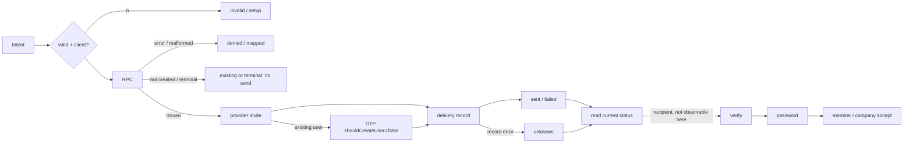

# Outbound invitation journey: source spec at `f6164b8`

**Status: partial.** This spec comes only from the four files you pasted. I didn't read anything else, and I didn't write a plan file because you asked for no tools or files. The SQL, the callback routes, the invite form pages and provider runtime behaviour are all unknown. Nothing here counts as runtime acceptance or a measured click. R2 and 100% closure stay open. The visual reference is the pinned Concept C, and no new UI view is proposed.

## Actors and scope
- **Admin (operator):** `createInvitationAction` returns form state. `reissueInvitationAction` and `revokeInvitationAction` are form posts.
  - The actions don't check the session. SQL RPCs called through the session client decide who is allowed.
  - A missing session check in the action does not show that an unauthorized RPC succeeds. Only an SQL review can show that.
- **Member (tenant):** `inviteMemberFormAction` returns form state. `inviteMemberAction` is a plain form post, and I can't tell from source whether anything uses it. `reissueMemberInvitationAction` and `revokeMemberInvitationAction` are form posts.
  - `tenantId` is mainly a route hint. Reissue and revoke send only `invitationId`, so SQL decides the real invitation scope.
- **Later scope, not covered here:** member access state, role changes, people bundles and leave self-service.

## Order of operations
- **Create:** check input, then server client, then create RPC with the idempotency key. If the RPC says the invitation was not newly created, nothing is sent. Otherwise the delivery helper runs.
- **Reissue:** RPC, then the terminal check, then the delivery helper.
  - Admin stops only when the state is `expired`.
  - Member stops whenever `created !== true`.
- **Revoke:** RPC, then the resulting state. Nothing is sent.
- **Admin delivery helper:** `inviteUserByEmail`. If that fails with an "existing user" error, it falls back to `signInWithOtp` with `shouldCreateUser: false`. It then records the result through the **session** RPC.
- **Member delivery helper:**
  1. Read the session user with `getUser`.
  2. Send only if the admin client, callback, user and email are all present.
  3. If the admin client or the user is missing, return `unknown` **without recording anything**.
  4. Otherwise record through the **service role**, passing `p_actor_user_id`. Whether SQL rechecks the actor's current authority is unverified.

These are separate states. Each one does not imply the next:
1. **Issued:** the RPC returned a row with an issuance number.
2. **Sent:** the provider API returned no error.
3. **Delivered or opened:** can't be observed from this code.
4. **Recipient verified and password set:** happens later, outside this code.
5. **Accepted:** the member joins or the company is created.

"Sent" never guarantees that the email arrived.

## Action outcome table
| Action | Bad input | No client | RPC error or malformed | Not created / terminal | Proceeds |
|---|---|---|---|---|---|
| admin create | state `invalid`, values kept, attempt+1 | state `setup` | state `forbidden` | redirect `?id&state=existing / already-accepted / already-revoked / expired` | `created-{sent,failed,unknown}` |
| admin reissue | `?state=invalid` | `setup` | `forbidden` (no id) | `expired` (with id) | `reissued-*` |
| admin revoke | `invalid` | `setup` | `forbidden` (with id) | n/a | `revoked` |
| member form | `invalid` text, email and key kept | `setup` | `mapError` text | `already-member / pending-exists / existing` | `people/{employeeId}?userLink=invite-*` or `users?state=created-*` |
| member invite | `invalid` (bad tenant goes to `/auth/login?state=invalid`) | `setup` | `mapError` | same as form | `created-*` |
| member reissue | `invalid` | `setup` | `mapError` (e.g. `issuer-lost`) | `expired / terminal` | `reissued-*` |
| member revoke | `invalid` | `setup` | `mapError` | n/a | `revoked` |

**Returned vs thrown errors:**
- A record error that comes back from the RPC becomes `unknown`, and the redirect still happens.
- A thrown error from the provider call or a rejected RPC fetch is not caught. The action throws after the issuance is already committed, and the stored delivery state is unknown (probably `sending`; needs SQL to confirm).

## What I found in the source
1. **Admin reissue** sends for any returned state except `expired`. It relies on SQL to reject accepted or revoked invitations.
2. **Admin RPC errors** all become `forbidden`, including conflicts and transient failures.
3. **Admin create validation is weak:**
   - the key pattern `[0-9a-f-]{36}` is loose;
   - the email has no format check;
   - `entityName` is optional.
4. **Member helper input is unchecked:** it casts the RPC result without validating it, so `id` and `issuance` reach the record RPC unchecked.
5. **Missing service role is handled differently:** the admin helper records `failed`, while the member helper returns `unknown` and records nothing.
6. **Member form key is retained** after every failure. If someone changes the email after an `already-member` or `pending-exists` result, the same key may hit a key conflict. That depends on how SQL treats the key.
7. **Both revoke actions ignore the returned data.** Whether an idempotent no-op still shows `revoked` is unknown.
8. **Member `expired` shows as a success toast.**
9. **`inviteUserByEmail` creates an auth user before acceptance.** Source shows no tenant privilege granted at that point, but this needs verifying.
10. **Reissue has no server-side double-submit guard.** Every reissue makes the previous link invalid.
11. **Member redirects leave out the invitation id**, while admin redirects highlight the selected row.
12. **Unknown from source:**
   - what each RPC actually authorizes across tenants;
   - how idempotency works;
   - how issuance mismatches are handled;
   - what the callback, verify, password and accept steps do.

## Invariants to keep
- No automatic send or retry, and no new privileges.
- The service role is used only for auth admin calls and the member delivery record.
- Seats are counted only on acceptance (SQL decides this).
- Seat and site limit handling stays the same.
- Retained form values and idempotency keys, existing redirect URLs and state strings, and Concept C visuals all stay as they are.

## Next implementation candidates
**Class C: local, fail-closed, no SQL or UI-view change**
- **C1:** Admin reissue treats any returned state other than pending as terminal and doesn't send.
- **C2:** Both delivery helpers wrap the provider and record calls in try/catch and return `unknown`.
- **C3:** The member helper checks the result's shape before sending or recording.
- **C4:** Admin create uses a strict UUID check for the key and the member email pattern.
- **C5:** Member `expired` becomes an alert, not a success toast.

**Material decisions (decide before coding)**
- **M1:** When to rotate the idempotency key after a result that wasn't newly created.
- **M2:** An error taxonomy for admin RPCs. This needs the SQL error codes.
- **M3:** How a member delivery failure gets recorded when the service role is missing.
- **M4:** What revoke shows for an idempotent no-op, and whether reissue gets a double-submit guard.
- **M5:** Whether to keep or remove `inviteMemberAction`, and whether member redirects should include the invitation id.
- **M6:** The email wording for the OTP fallback for existing users.

## Test groups for later qualification (bounded; none written now)
- **T1:** Input and setup failures for each of the seven actions (mocked).
- **T2:** RPC outcome cases: thrown error, malformed result, and each not-created state.
- **T3:** Delivery helper paths: no admin client, no callback, invite succeeds, existing user then OTP succeeds or fails, other provider failure, record error, thrown error.
- **T4:** Each redirect state mapped to how the page shows it (toast, alert or invitations view).
- **T5:** SQL qualification: cross-tenant access, lost authority, replay and key conflict, reissue of a terminal invitation, the actor recheck in the record RPC, stale issuance.
- **T6:** Provider sandbox: one new user and one existing user, once each, to confirm that "sent" doesn't mean delivered.

## Next action
Do a read-only review of the eight RPCs: create, reissue and revoke for both admin and member, plus the two delivery-record RPCs. It should answer findings 1, 6, 7 and 9 and confirm the actor recheck. Then apply C1–C3.