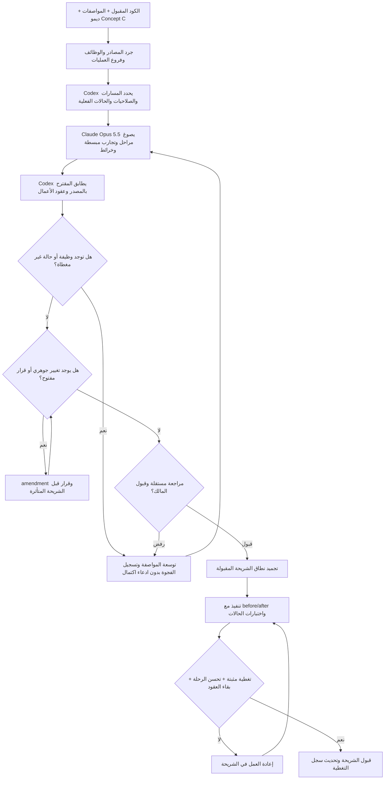
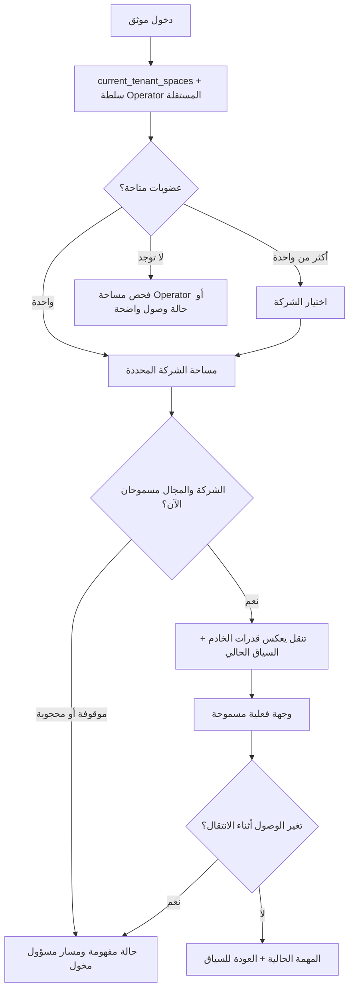
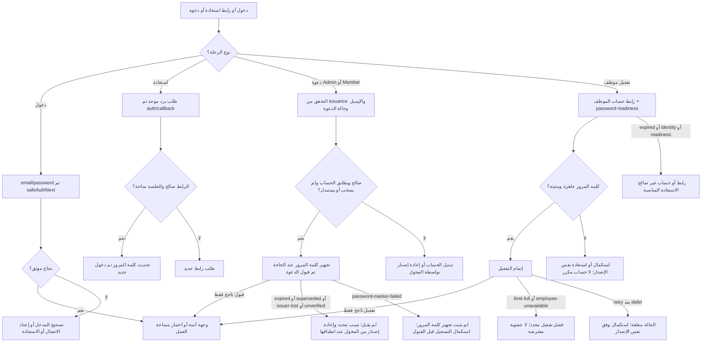
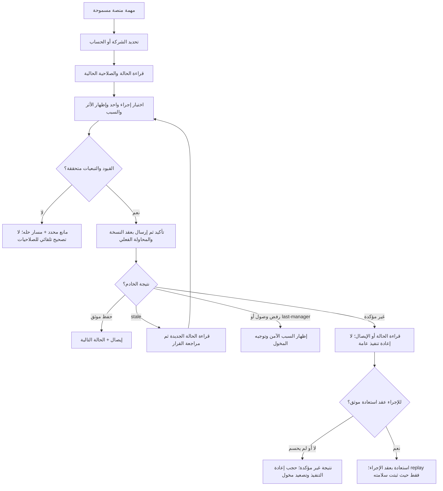
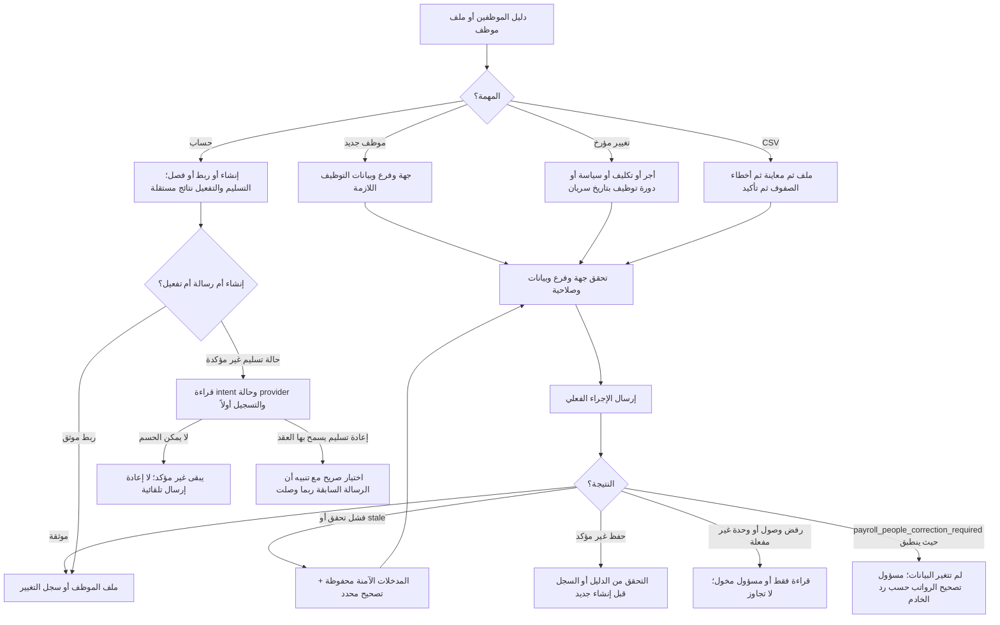
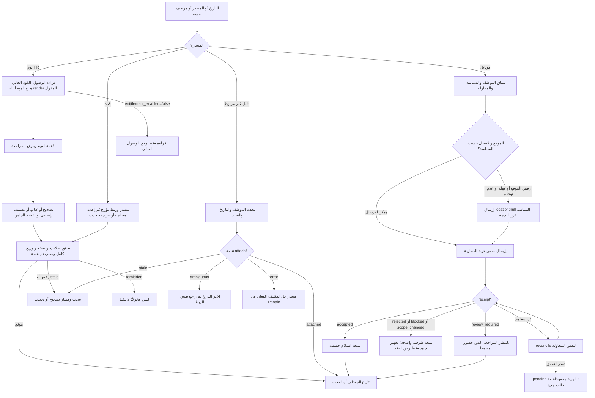
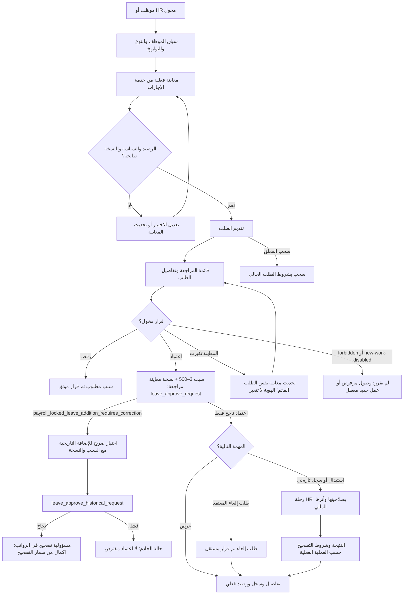
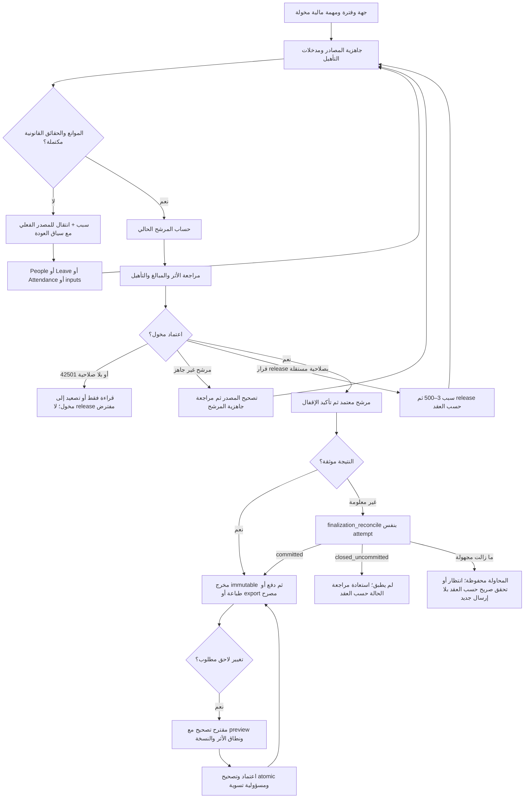
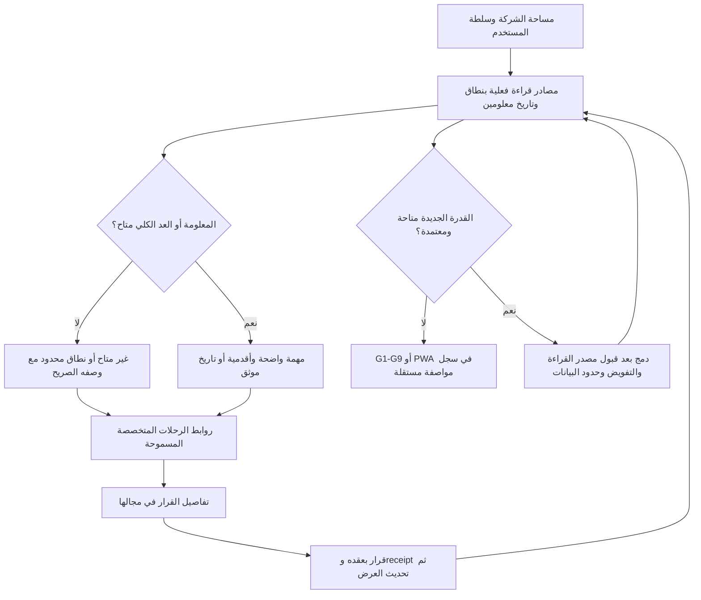

# خرائط الرحلات ومراجعة المسارات — مساهمة Codex، Proposed

هذه خرائط مهام وأدوار ونتائج، وليست رسم URLs فقط. تُقرأ مع مواصفات Claude Opus5.5 وسجل التغطية. كل عقدة تعديل مربوطة بالعقد الحالي، وكل اختلاف يحتاج قرارًا قبل التنفيذ. لا تعني هذه الرسومات أن كل الحالات اختُبرت.

## الخريطة العامة للمراجعة بين Codex وClaude

## R1 — اختيار مساحة العمل والتنقل

## R2 — الحساب والدعوات

تُرسم إدارة مستخدمي الشركة كرحلات إصدار/إعادة إصدار/سحب/وصول/حزمة/ترقية مستقلة في R2. إنشاء سجل الدعوة لا يعني إرسال البريد، ونجاح الإرسال لا يعني قبول الدعوة. لا تخزن كلمة مرور لاستعادة الشاشة.

## R3 — Operator: القرار والتأثير والتعارض

إصدار قواعد statutory يمر بمسودة ثم مقارنة أدلة ثم إصدار؛ لا يختزل إلى حفظ إعداد. الانتقالات والحماية والصلاحيات تُراجع لكل إجراء حسب المصدر.

## R4 — People: إنشاء أو تغيير مؤرخ

## R5 — الحضور والقرار ومحاولة الموظف

تغيير فتح اليوم إلى زر صريح ما زال amendment مقترحًا. بعد reload لمحاولة الموبايل، الاستعادة reconcile وفق المصدر؛ لا تخزين payload الموقع أو إنشاء محاولة جديدة تلقائيًا.

## R6 — الإجازات من الموظف إلى HR وإلى الأثر

سياسات الإجازة/التقويم/فترات السنة والترحيلات والرصيد السنوي وظائف R6 مستقلة؛ لا حساب أيام أو21 يومًا في الواجهة.

## R7 — الرواتب والإقفال والتصحيح والاستعادة

حالات advance/payment وتصحيح المصدر ليست نفس الحالات: يظل اسم إغلاق المحاولة وشرط إعادة الإرسال مطابقًا لكل RPC. لا تقسيم retry لمحاولات مالية failed-only، ولا صافي من حقائق مجهولة، ولا undo عام بعد الإقفال.

## R8 — اليوم والقرارات والعودة إلى المهمة

## قواعد إغلاق الخرائط

- لكل action/فرع operation وendpoint وكل رابط عابر للمجالات صف في سجل السيناريوهات، ومعرف case في مرحلة محددة.
- كل role×state قابل للوصول له نتيجة؛ التركيبات غير الممكنة تشرح constraint بدل حذفها من المقام.
- حالات المدخلات تختبر بفئات تكافؤ وحدود، مع exhaustive لحالات الأعمال المحدودة والصلاحيات والتعديل المالي.
- الجهات والتاريخ والموظف ومسار العودة لا تضيع بين الشاشات. المانع يقود إلى مصدر حله الموجود فقط.
- لا تقاس سهولة الرحلة بقلة الأزرار وحدها؛ قس قبل/بعد التنقلات وإعادة اختيار السياق والحقول والأفعال الأساسية المتنافسة وفهم النتيجة.
- تظل الخرائط Proposed حتى مراجعة Claude+Codex وتوسعة case registry وقبول الشريحة؛ اختبار التنفيذ حالة منفصلة.
