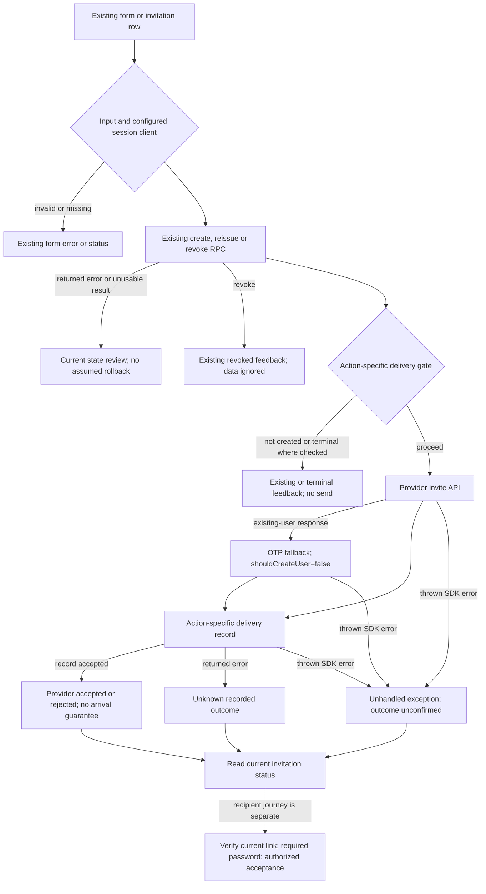

# Outbound invitations — source contract and journey map

Proposed, not Frozen. Source f6164b81bc8dc654344590919432db26ae54981c. Read with outbound-invitation-scenarios.json and immutable claude-outbound-invitations-contribution.md; corrections here govern interpretation. Seven public actions, two private delivery helpers and90 **draft source partitions**, not complete semantic/role/operation/SQL/provider or executed coverage. No application implementation changed. Access/role/People/leave controls in the same users file remain separately required.

## Actor, task and simplest safe continuation

Operator invites a first company administrator; authorized tenant manager invites a member, optionally from a linked employee page. Entry: existing new-invitation form or invitation list. Desired outcome: recipient uses the current link and completes server-authorized setup/acceptance. Issuance, provider API acceptance, actual delivery/opening, recipient verification/password readiness and tenant membership/company creation are separate outcomes. Do not collapse them into one success toast or imply a seat/company exists from email dispatch.

Preserve bounded operator form values/key/attempt; member form email/prior state key/attempt and employee return route. Tenant, role and invitation scope follow existing server contracts. Routes/query values never supply authority. Returning the same key supports current intended replay; changing it automatically could duplicate or alter intent and requires actual SQL review. No credentials/tokens stored in specs or retained forms.

| Operation | Actual source gate and continuation |
|---|---|
| Admin create | Invalid/setup/RPC error or unusable row returns form state. Existing accepted/revoked/expired/other redirect without delivery. created=true invokes helper then created-sent/failed/unknown with selected invitation id |
| Admin reissue | Invalid/setup/RPC error/unusable row deny. Only explicit expired stops delivery after valid row; other returned lifecycle states reach helper. reissued-sent/failed/unknown keep id |
| Admin revoke | Invalid/setup deny. Returned RPC error→forbidden; no returned error→revoked; data ignored. No delivery |
| Member form create | Invalid/setup/mapped error/unusable row/already-member/pending-exists/existing returns email/key/attempt. created=true helper; users created-* or valid employee UUID destination invite-* |
| Member legacy create | Same creation partitions, redirects rather than returning state; users created-*; do not remove exported action from search absence alone |
| Member reissue | Invalid/setup/mapped error/unusable result deny. created!=true→expired or terminal, no send; otherwise helper and reissued-* |
| Member revoke | Invalid/setup/mapped error deny; no returned error→revoked, data ignored; no send |

The action-specific gate is not uniform: admin reissue checks only expired, member reissue requires created=true. Admin missing configuration still attempts session delivery-record RPC with succeeded=false; record error yields unknown. Member missing admin or current user returns unknown without recording. Member callback/email absence with admin+user attempts a failure record; it must not be described as no-record on every malformed path. Provider existing-user fallback applies only recognized code/message and does not request creating another user. Returned and thrown failures have different source control flow.

## Corrections to Claude's contribution

1. Its uniform terminal/no-send diagram is an intended simplification, not actual admin reissue behavior; use the action table above. No new lifecycle gate is accepted merely by this diagram.
2. A thrown call escapes. Stored delivery state (e.g. sending) and issuance commit/rollback cannot be established from these action files alone. A prior successful RPC response is source evidence, not an independently proven transaction guarantee.
3. Missing admin in the admin helper attempts recording failed; returned record error still makes the result unknown. Member missing-admin/user bypasses recording. Do not call either universal confirmed failure.
4. Member getUser obtains an actor; it does not prove current SQL permission revalidation. The service-role record's eligible actor/tenant/issuance binding must be independently reviewed.
5. No double-submit/idempotency guard is visible at these action boundaries; this is not proof the SQL lacks locking/replay protection. No delivered/opened/actual account-creation guarantee is proven by provider method names.
6. Recipient callback/password/accept specifications exist elsewhere in this repository; they were outside the four files supplied to this contribution, not missing platform capabilities.
7. Suggestions C1–C4 change lifecycle guards, exception semantics, input validation or record shape. Define scoped amendments/compatibility after read-only RPC review; do not treat the suggested ClassC labels as automatic authority to implement. Removal of an exported action, idempotency rotation, new delivery record fallback and scope changes require dedicated review.
8. Member expired currently appears in successMessage and in invitation-tab routing; correct tone needs a scoped presentation review, not removal of the expired operation. Generic users failed feedback asserts no membership change despite uncertain paths: assess actual operation before changing shared copy.

## Coverage and economical qualification

90 records have exact source SHA, action/RPC IDs, actor/scope, source partition/outcome and known missing qualification. They remain draft: generic mapped errors still need expansion into each real limit/authority/target/key/role case, and all seven operations need cross-tenant, denied/changed actor, duplicate/replay, stale issuance, concurrent reissue/revoke/accept and current authoritative visible outcomes. Delivery privacy/provider/callback/origin and sanitized-error behavior require review too. Add these before freezing; do not use90 as a complete denominator. Existing1523 registry states and94 recipient drafts are untouched.

Reuse unchanged recipient/Auth/palette/layout evidence. Next executable work: read actual eight create/reissue/revoke/delivery-record RPC contracts; then approve bounded presentation/error-recovery changes against those outcomes. Later one shared SDK-stub table can qualify all seven actions/helpers together; group page feedback/retained values/selected-row/tab behavior into the same acceptance batch. SQL authority/concurrency and a minimal new/existing-account provider check belong only to appropriately scoped synthetic access. The expired QA access stays retired. No heavy tests/build repeated for this documentation-only preparation; JSON IDs/fingerprints and unchanged source identity suffice.

No measured navigation/input reduction is claimed from source alone. Full R2 and R0–R8 coverage, actual mobile/keyboard journeys, privacy/financial/device acceptance and runtime/provider/SQL remain open. Pinned Concept C remains permanent visual reference; this turn defines no visual change or new UI view. Cooperation: official Code2.1.292 / claude-opus-5-5 / medium, session5bb5ee0d-892d-4673-accf-685a0119a363,1 turn/0 tools, readOnlyViolation=false. Codex independently checked the supplied source sequences and applied the corrections above.
