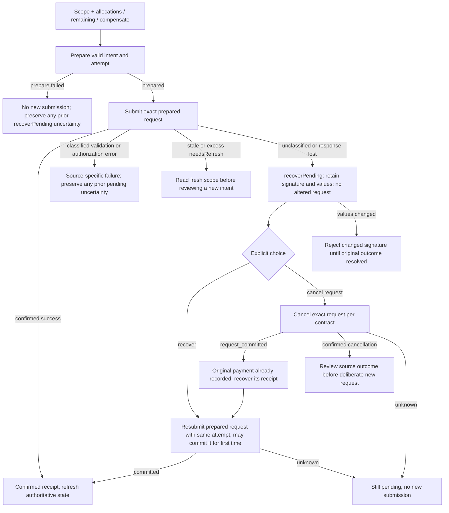
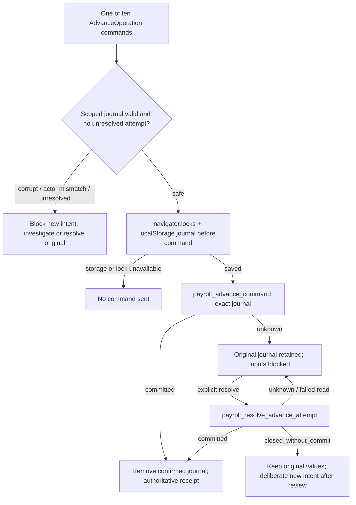
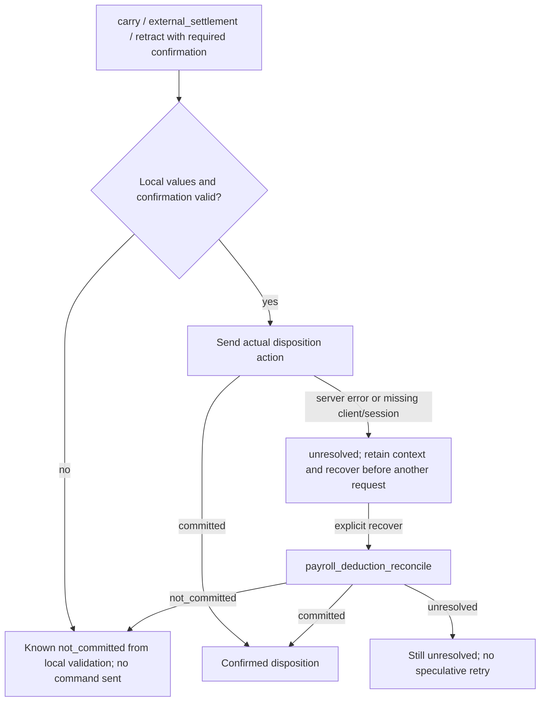
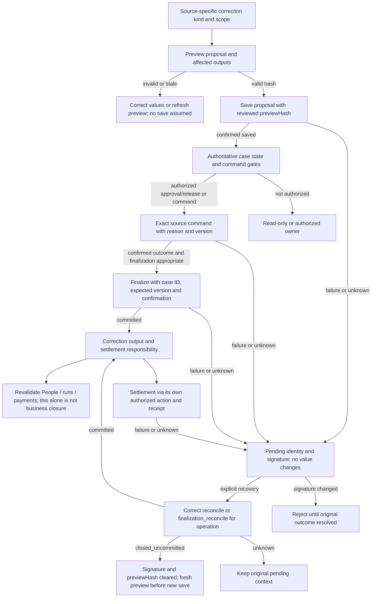

# R7 — Financial recovery subjourneys (Proposed)

Read with the coverage contract and action source. These diagrams separate confirmed outcome, pending identity, reconciliation and deliberate resubmission. They do not enumerate every validation/role/operation combination; those remain mandatory before Frozen. Access and actor checks remain server-authoritative at every action. Unclassified failure does not mean uncommitted.

## Payments: prepare, submit, recover and cancel

## Advances: scoped persistent journal and resolve

Ten commands: save, approve, activate, cancel, settle, compensate, termination, defer, correct_deduction, correct_disbursement. Resolution is not a generic eleventh financial action. Source journal includes actor/tenant/employer/intent; no observed time expiry. Privacy/retention policy remains a review gate.

## Deduction disposition: unresolved is a distinct state

## Corrections: preview, scope, pending signature and finalization

Inputs valid kind×command combinations, all correction kinds/commands, private export/print authorization, first/subsequent page export and complete-report revision checks remain separate case registries. Unclassified overtime is X4, a non-blocking warning rather than an invented financial blocker. No chart arrow is automatic replay or permission to omit a confirmation.
